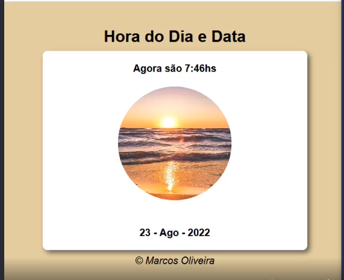

# Calendário

# skills utilizadas nesse projeto
<li>HTML</li>
<li>CSS</li>
<li>javaScript</li>

<li>Esse sistema mostra a hora atual, uma foto com uma imagem, que é atualizada de acordo com o período do dia e mostra também a data atual.</li>

# Imagem

